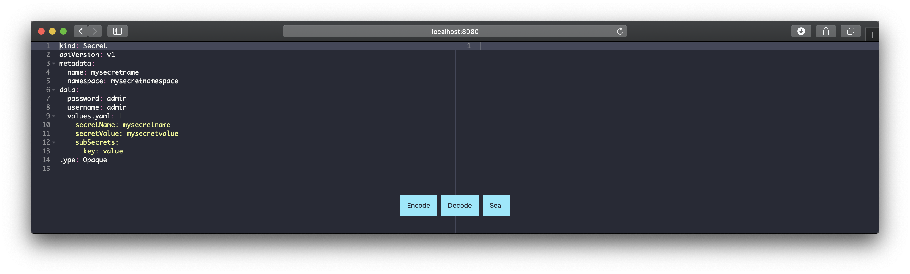
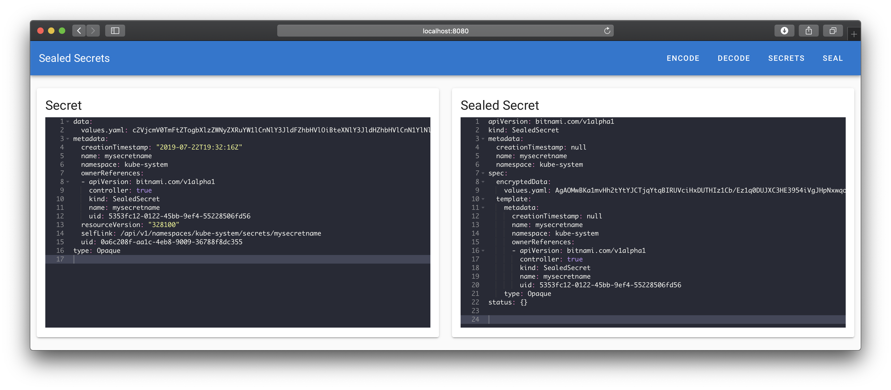

<div align="center">
  
  <br><br>

  A web interface for [Sealed Secrets](https://github.com/bitnami-labs/sealed-secrets) by Bitnami.

  
  
</div>

**Sealed Secrets Web** is a web interface for [Sealed Secrets](https://github.com/bitnami-labs/sealed-secrets) by Bitnami. The web interface let you encode, decode the keys in the `data` field of a secret, load existing Sealed Secrets and create Sealed Secrets. Under the hood it uses the [kubeseal](https://github.com/bitnami-labs/sealed-secrets/tree/master/cmd/kubeseal) command-line tool to encrypt your secrets. The web interface should be installed to your Kubernetes cluster, so your developers do not need access to your cluster via kubectl.

- **Encode:** Base64 encodes each key in the `data` field in a secret.
- **Decode:** Base64 decodes each key in the `data` field in a secret.
- **Secrets:** Returns a list of all Sealed Secrets in all namespaces. With a click on the Sealed Secret the decrypted Kubernetes secret is loaded.
- **Seal:** Encrypt a Kubernetes secret and creates the Sealed Secret.

## Installation

**sealed-secrets-web** can be installed via our Helm chart:

```sh
helm repo add bakito https://bakito.github.io/helm-charts
helm repo update

helm upgrade --install sealed-secrets-web bakito/sealed-secrets-web
```

To modify the settings for Sealed Secrets you can modify the arguments for the Docker image with the `--set` flag. For example you can set a different `controller-name` during the installation with the following command:

```sh
helm upgrade --install sealed-secrets-web bakito/sealed-secrets-web --set image.args={"--kubeseal-arguments=--controller-name=sealed-secrets"}
```

## Development

For development, we are using a local Kubernetes cluster using kind. When the cluster is created we install **Sealed Secrets** using Helm:

```sh
./kind.sh

helm repo add sealed-secrets https://bitnami-labs.github.io/sealed-secrets
helm install sealed-secrets sealed-secrets/sealed-secrets --namespace kube-system

# Test the installation:
echo -n bar | kubectl create secret generic mysecret --dry-run=client --from-file=foo=/dev/stdin -o json >mysecret.json
kubeseal <mysecret.json >mysealedsecret.json --controller-name sealed-secrets
kubectl create -f mysealedsecret.json
kubectl get secret mysecret
```

if the service is not found, export the api and use the cert path
```sh
kubectl -n kube-system port-forward deployment/sealed-secrets 9090:8080

kubeseal <mysecret.json >mysealedsecret.json --cert=http://localhost:9090/v1/cert.pem
```

Then we can build the Docker image and push it to the local registry:

```sh
docker build -f Dockerfile -t localhost:5000/sealed-secrets-web:dev .
docker push localhost:5000/sealed-secrets-web:dev
```

Finally we can install **Sealed Secrets Web** using the provided Helm chart:

```sh
kubectl create namespace sealed-secrets-web

helm upgrade --install sealed-secrets-web bakito/sealed-secrets-web --namespace sealed-secrets-web --set image.args={"--kubeseal-arguments=--controller-name=sealed-secrets"} --set image.repository=localhost:5000/sealed-secrets-web --set image.tag=dev --set image.pullPolicy=Always

# Access the Web UI:
kubectl port-forward svc/sealed-secrets-web 8080:80
```
