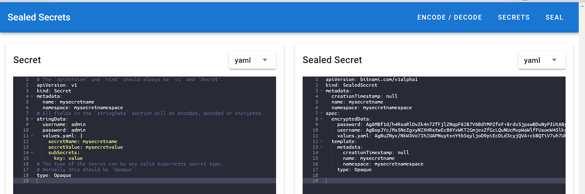
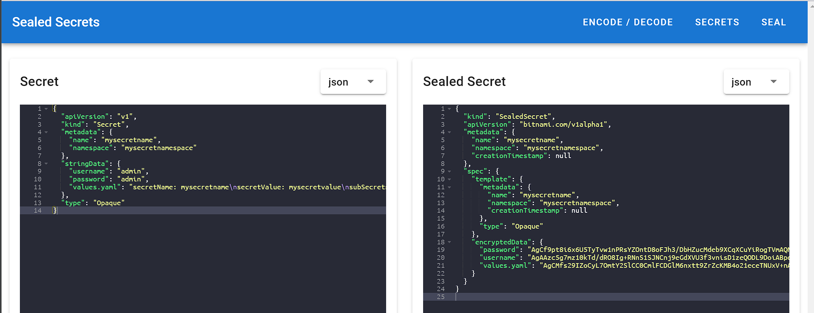

  
    

  A web interface for [Sealed Secrets](https://github.com/bitnami-labs/sealed-secrets) by Bitnami.

  
  

**Sealed Secrets Web** is a web interface for [Sealed Secrets](https://github.com/bitnami-labs/sealed-secrets) by Bitnami. The web interface let you encode, decode and encrypt you secrets. It uses the same functions as the [kubeseal](https://github.com/bitnami-labs/sealed-secrets/tree/master/cmd/kubeseal) command-line tool to encrypt your secrets. The web interface should be installed to your Kubernetes cluster, so your developers do not need access to your cluster via kubectl.
